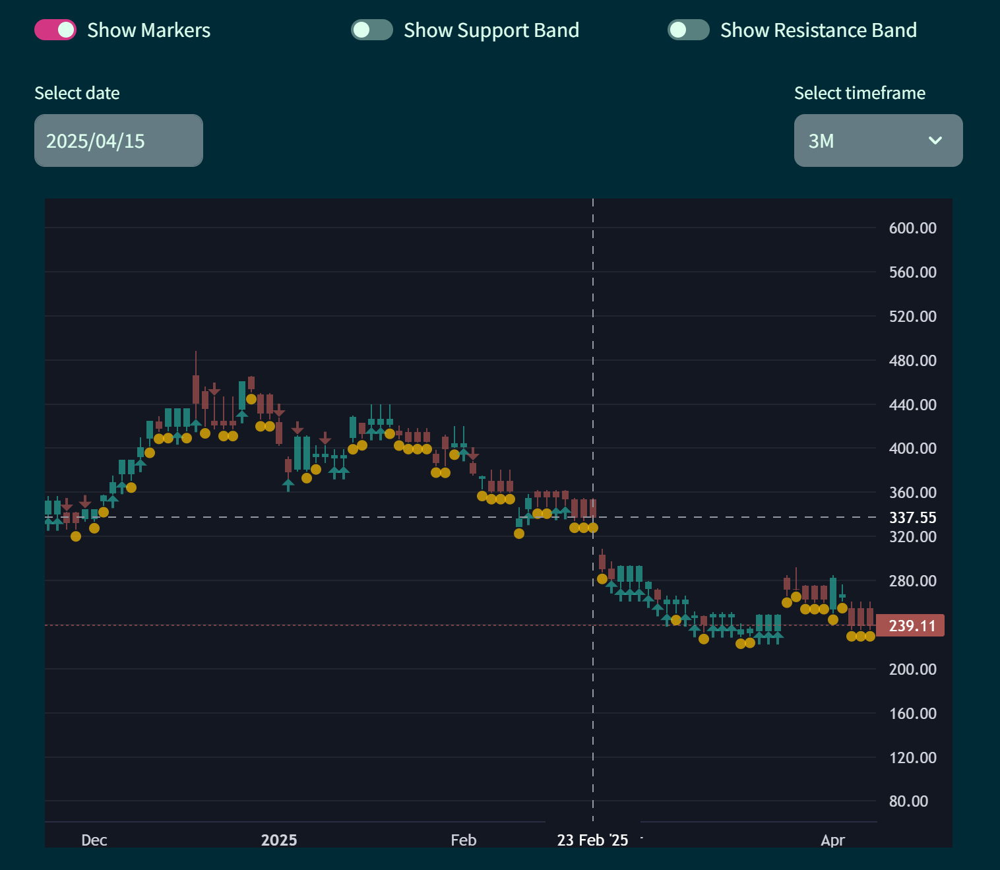
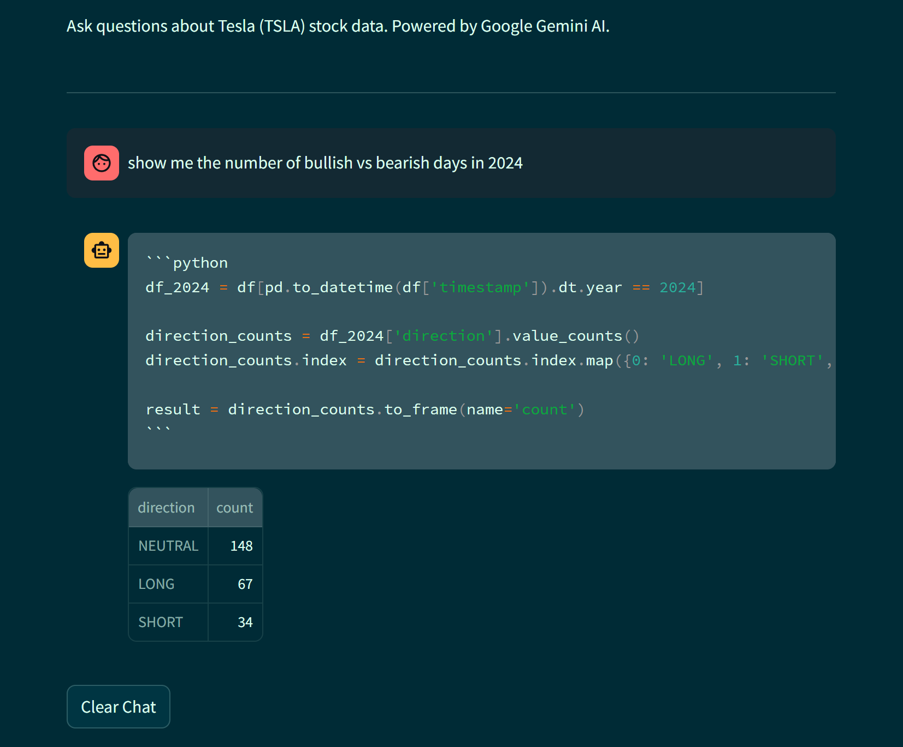

# TradingView AI Dashboard

A Streamlit-based dashboard for visualizing TSLA stock data and querying it through an AI chatbot powered by the Gemini
API.

---

## 🚀 Features (and tech used)

- 📈 Interactive charts showing TSLA price trends, support, and resistance levels (using a [streamlit wrapper](https://github.com/freyastreamlit/streamlit-lightweight-charts) of TradingView's [LightWeight Charts](https://tradingview.github.io/lightweight-charts/))
- 🤖 Gemini-powered AI chatbot to answer natural language questions about the data (using Google's [Gemini 2.0 flash](https://ai.google.dev) model)
- 💾 Efficient data loading and preprocessing using caching (using [Pandas](https://pandas.pydata.org), [NumPy](https://numpy.org))
- 🧪 Built as a personal project for experimentation with finance and AI 

---

## 💬 Example Questions

You can ask the chatbot questions like:

- How many days in 2023 was TSLA bullish?
- What was the longest bullish streak this year?
- How often did TSLA touch a resistance level in Q1?
- When was the last time TSLA switched from SHORT to LONG?
- What are the typical support levels in June?
- What is the average price of TSLA in 2023?
- Plot the TSLA price chart for the First Quarter of 2023.
- Show the number of bullish versus bearish days in Jan 2024.

---

## 📸 Screenshots

### Chart Dashboard



### AI Chatbot Interface



---

## 🛠 Getting Started

1. **Clone the repository:**
   ```bash
   git clone https://github.com/your-username/tradingview-ai-dashboard.git
   cd tradingview-ai-dashboard
    ```

2. **Install dependencies:**
   ```bash
    pip install -r requirements.txt
    ```

3. **Set up your Gemini API key**
   Create a file at `.streamlit/secrets.toml` and add the following:

   ```toml
   [gemini]
   api_key = "your_api_key_here"
   demo_mode = "false"
   ```
   Set demo_mode = "true" if you want to disable live calls and test the UI, and make sure to replace
   `your_api_key_here` with your actual Gemini API key.


4. **Run the Streamlit app:**
   ```bash
    streamlit run streamlit_app.py
    ```

---

## ⚠️ Notes

- This is a personal project and not production-ready.
- The Gemini API is used for natural language processing and may incur costs based on usage.
- Only supports a static TSLA dataset (upto 2nd May, 2025) currently, but can be extended to other stocks with some
  modifications.
- Future improvements could include more advanced analytics, real-time stock data, and context history for the chatbot.

